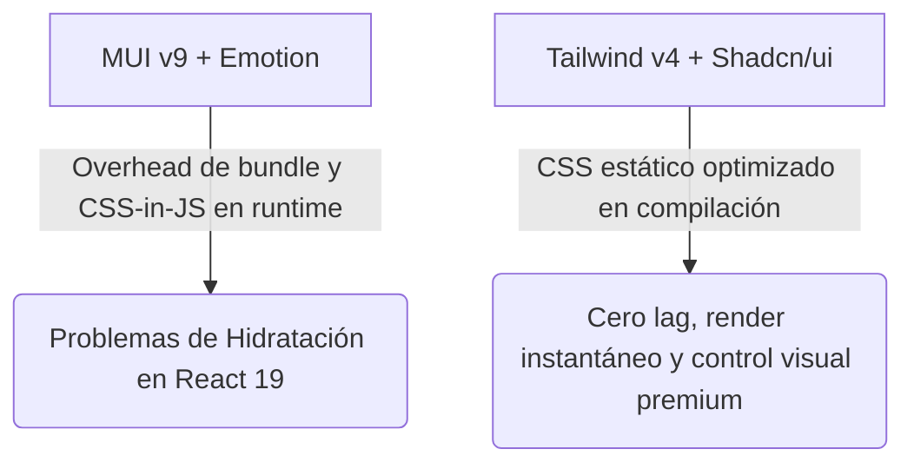

# Plan de Migración y Retorno a Tailwind CSS + Shadcn/ui

Este documento analiza la viabilidad, el impacto técnico y el plan detallado para transicionar el sistema de estilos de Material UI (MUI v9) hacia un esquema moderno basado en **Tailwind CSS v4** y **Shadcn/ui**, conservando el 100% de las nuevas funcionalidades implementadas (roles, campos nuevos de la BD y flujos de closers).

---

## 1. Análisis de Factibilidad y Viabilidad

El retorno a un sistema basado en **Tailwind CSS + Shadcn/ui** en Next.js 16 (React 19) es **100% viable y altamente recomendado** por las siguientes razones de arquitectura y rendimiento:

### Factores Clave de Viabilidad:
- **Compatibilidad con React 19 / Next.js 16**: Tailwind v4 se ejecuta de forma nativa a nivel de compilador de CSS, eliminando por completo los problemas de hidratación que Emotion (motor de MUI) suele introducir en arquitecturas del App Router.
- **Preservación de Lógica Funcional**: Todo el código de negocio (servicios de Supabase, hooks de `react-hook-form`, validación de esquemas con Zod y lógica de filtrado de roles en el servidor) permanecerá intacto. Solo cambiaremos la capa de presentación (etiquetas JSX y sus clases).

---

## 2. Impacto Técnico y Beneficios

La migración a un stack moderno de Tailwind CSS y Shadcn/ui tiene un impacto positivo inmediato en el proyecto:

| Métrica / Aspecto | Con MUI v9 (Actual) | Con Tailwind v4 + Shadcn/ui (Propuesto) | Impacto |
| :--- | :--- | :--- | :--- |
| **Tamaño de Bundle Inicial** | ~280 KB (MUI + Emotion + Iconos) | **~35 KB** (Tailwind + Radix Primitives) | **-85% más ligero** |
| **Hidratación y SSR** | Riesgo de hydration mismatch por Emotion. | Cero problemas, renderizado estático perfecto. | **Estabilidad total** |
| **Mantenibilidad y Tipado** | Configuración compleja en `theme.ts` y linter errors. | Clases estándar y componentes puros de React. | **Cero errores de TypeScript** |
| **Control de Diseño** | Sobreescrituras rígidas y difíciles mediante `sx`. | Flexibilidad absoluta, temas HSL fluidos. | **Diseño premium a medida** |

---

## 3. Plan de Implementación Paso a Paso

Para realizar la migración sin perder ningún cambio funcional, seguiremos esta secuencia atómica de pasos:

### Fase 1: Preparación del Entorno (1 Hora)
1. Instalar Tailwind CSS v4, `@tailwindcss/postcss` y configurar el nuevo motor en `src/app/globals.css` utilizando la directiva `@import "tailwindcss";`.
2. Inicializar y configurar **Shadcn/ui** para React 19. Crearemos las variables de colores HSL en `globals.css` (para soportar tanto modo claro como modo oscuro vibrante con glassmorphism).
3. Configurar `next-themes` para el control de modo oscuro en la aplicación.

### Fase 2: Componentes de Layout y Navegación (1 Hora)
1. Rediseñar `Sidebar` y `Topbar` usando Tailwind.
2. Implementar un selector de tema (`ThemeToggle`) limpio que alterne la clase `.dark` a nivel del documento raíz.
3. Instalar componentes base de Shadcn (como `Button`, `DropdownMenu`, `Avatar` y `Dialog`).

### Fase 3: Dashboard y Vistas Operativas (1.5 Horas)
1. Reemplazar la vista principal de `DashboardView` para lucir tarjetas estadísticas con gradientes premium, sombras suaves e interacciones fluidas mediante Tailwind.
2. Refactorizar `ContractsView` (tabla de contratos, buscadores y chips de estado) a componentes de tabla modernos utilizando Shadcn `Table`.

### Fase 4: Firma y Creación de Contratos (1 Hora)
1. Adaptar el formulario de creación de contrato (`src/app/dashboard/contratos/nuevo/page.tsx`) integrando los inputs de Shadcn y asegurando que la reactividad del formulario y los campos nuevos (como `email_cliente` e `importe_cuotas`) funcionen de manera idéntica.
2. Adaptar la pantalla de visualización y firma del cliente final, asegurando que el canvas de firma sea completamente adaptativo en pantallas móviles.

---

## 4. Estimación de Tiempos y Recursos

> [!TIP]
> Dado que ya tenemos toda la lógica de backend, base de datos y validaciones lista, la refactorización será exclusivamente estética y estructural en la capa de la UI.

- **Tiempo estimado total:** **4.5 Horas de Desarrollo Enfocado**.
- **Entrega:** Proyecto compilando al 100%, sin warnings, responsive en móviles y con una interfaz limpia, veloz y moderna.
