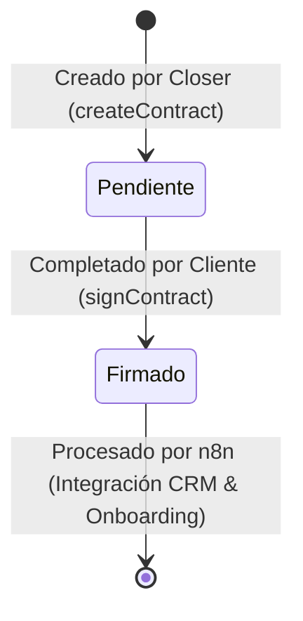

# Base de Datos y Gestión de Contratos

En esta sección se describe la estructura de datos relacional implementada en **Supabase** para dar soporte a la plataforma, el flujo del ciclo de vida de los contratos legales y el motor de renderizado de plantillas.

---

## 🗄️ Estructura del Esquema en Supabase

El sistema consta de dos tablas principales integradas con reglas de seguridad y control de sesión:

### 1. Tabla `contratos`
Almacena la información de cada venta y acuerdo legal emitido por la escuela.

| Columna | Tipo de Datos | Descripción |
| :--- | :--- | :--- |
| `id` | `UUID` (PK) | Identificador único autogenerado de la transacción. |
| `nombre_cliente` | `VARCHAR` | Nombre completo del prospecto/alumno. |
| `email_cliente` | `VARCHAR` | Correo electrónico del cliente. |
| `telefono_cliente` | `VARCHAR` | Teléfono internacional del cliente (formato recomendado: `+prefijo`). |
| `numero_cuotas` | `INTEGER` | Cantidad de cuotas del plan de pago (ej. `1` para pago único, `3` o `6` para financiamiento). |
| `importe_cuotas` | `NUMERIC` o `VARCHAR`| Importe individual de cada cuota. |
| `moneda` | `VARCHAR` | Tipo de divisa acordada (ej. `EUR`, `USD`). |
| `dia_cobro` | `INTEGER` | Día del mes acordado para debitar las cuotas recurrentes. |
| `tipo_contrato` | `VARCHAR` | Identificador único del template legal seleccionado (ver mapeo abajo). |
| `estado` | `VARCHAR` | Estado de la firma. Valores permitidos: `pendiente` o `firmado`. |
| `firma_data` | `TEXT` | Representación gráfica de la firma manuscrita en formato **Base64** (Data URI). |
| `nombre_cliente_contrato` | `VARCHAR` | Nombre legal ingresado al momento de certificar la firma. |
| `fecha_nacimiento_cliente`| `VARCHAR` | Fecha de nacimiento legal del firmante. |
| `user_id` | `UUID` (FK) | Identificador del Closer de ventas que generó el contrato. Relaciona con `user_profiles`. |
| `signer_ip` | `VARCHAR` | Dirección IP desde la cual el cliente realizó la firma digital. |
| `signed_at` | `TIMESTAMP` | Timestamp exacto en el que se firmó el contrato. |
| `created_at` | `TIMESTAMP` | Fecha de emisión de la propuesta de contrato. |
| `updated_at` | `TIMESTAMP` | Fecha del último cambio del registro. |

### 2. Tabla `user_profiles`
Mapea la información interna de la cuenta del Closer/Administrador para la atribución y automatizaciones de notificaciones.

| Columna | Tipo de Datos | Descripción |
| :--- | :--- | :--- |
| `id` | `UUID` (PK) | Relaciona uno a uno con el usuario de Supabase Auth. |
| `closer_name` | `VARCHAR` | Nombre del closer (ej. `Daniel`, `Albert`, `Nathalia`) utilizado para enrutamientos de mensajes. |

---

## 🔄 Ciclo de Vida del Contrato

El estado de un contrato evoluciona de manera lineal a través de dos etapas:



1. **Pendiente**: El Closer completa el formulario de emisión. Se le envía de inmediato un enlace único `/contrato/[id]` al cliente.
2. **Firmado**: El cliente accede al enlace público, verifica las cláusulas del plan de estudios y la financiación, ingresa su nombre certificado, fecha de nacimiento y firma digitalmente. Una vez presionado "Firmar", el estado cambia de forma inmutable y se gatillan los webhooks de automatización. El contrato ya no puede ser alterado.

---

## 📄 Plantillas de Contratos y Mapeo de Planes

Las plantillas legales se administran dinámicamente desde el directorio [src/utils/contract-templates/](file:///d:/devWork/lucem/proyects/revolucion-pineal-closers-app/src/utils/contract-templates/).
Cada archivo exporta una plantilla de texto legal con marcadores de posición dinámicos en formato markdown (ej: `[NOMBRE_CLIENTE]`, `[IMPORTE]`, `[NUMERO_CUOTAS]`, `[DIA_COBRO]`, `[MONEDA]`, `[FECHA]`).

### Mapeo Interno de Planes (`contractMapping`)
El sistema traduce el tipo de plantilla seleccionado en el formulario hacia una estructura unificada para el CRM y n8n:

```typescript
const contractMapping: Record<string, { plan: string; grupo: string }> = {
  acuerdo_acceso_advanced_healers: {
    plan: 'Advanced Healers',
    grupo: 'Advanced Healers',
  },
  alquimia_vital_eca: {
    plan: 'Alquimia Vital (E.C.A)',
    grupo: 'Alma',
  },
  alquimia_vilal_eca: {
    plan: 'Alquimia Vital (E.C.A)',
    grupo: 'Alma',
  },
  alquimia_vilal_energy_master: {
    plan: 'Alquimia Vital (Energy Master)',
    grupo: 'Alquimia',
  },
  oferta_iniciacion_vitalicio: {
    plan: 'Oferta Iniciación (Vitalicio)',
    grupo: 'Alquimia',
  },
};
```

---

## ✍️ Captura y Renderizado de la Firma Digital

1. **Captura Gráfica**: Utiliza el lienzo interactivo HTML5 de `react-signature-canvas` en el cliente. El trazo se convierte a una cadena de texto en formato de imagen PNG codificada en **Base64** (`data:image/png;base64,...`).
2. **Inyección en Servidor**: El Server Action `signContract` toma la plantilla de texto plano en markdown, reemplaza los tags dinámicos, la procesa a HTML mediante un parseador liviano (`markdownToHtml`) y ensambla el documento final incrustando la firma gráfica en Base64 en una plantilla con estilos optimizados para impresión/PDF.
3. **Consistencia Legal**: La IP del cliente (`signer_ip`) y la estampa de tiempo certifican la validez legal del acuerdo según la legislación aplicable a contratos electrónicos de adhesión.
