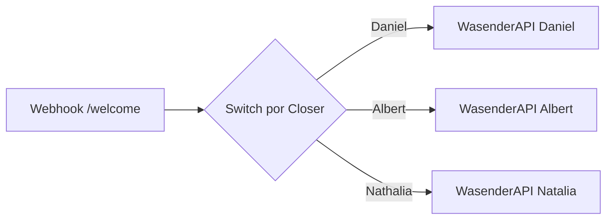
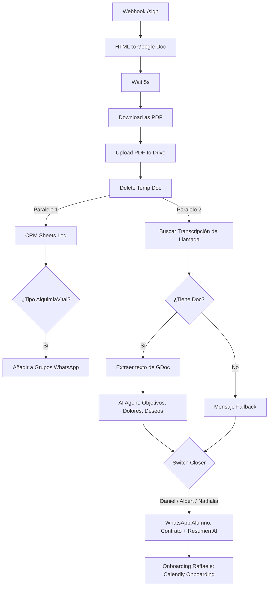

# Automatizaciones y Flujos en n8n

Las integraciones clave y automatizaciones del ecosistema de **Revolución Pineal** se encuentran estructuradas en dos flujos principales dentro de la carpeta `n8n_workflows/`. Ambos flujos reaccionan ante webhooks y realizan integraciones avanzadas con **Google Drive, Google Sheets, OpenAI** y **WasenderAPI**.

---

## 📞 Flujo 1: Bienvenida (`step_1_send_msg_welcome.json`)

Este flujo automatiza el envío del acuerdo de acceso cuando un Closer emite una nueva propuesta en la aplicación.

### Componentes y Lógica Paso a Paso:
1. **Trigger Webhook (`trig_webhook_welcome`)**:
   * Reacciona ante una petición HTTP POST en el path `/welcome` desde el Server Action `createContract`.
   * Parámetros recibidos: `nombre_cliente`, `telefono_cliente`, `link_contrato`, `closer_name`.
2. **Switch por Closer (`Switch por Closer`)**:
   * Enruta la ejecución de acuerdo al valor de `closer_name`.
   * Ramas:
     * `Daniel` ➡️ Redirige al nodo `post_whatsapp_daniel1`.
     * `Albert` ➡️ Redirige al nodo `post_whatsapp_albert1`.
     * `Nathalia` ➡️ Redirige al nodo `post_whatsapp_nathatia1`.
3. **Envío de WhatsApp (`WasenderAPI`)**:
   * Cada Closer cuenta con sus propias credenciales Bearer asociadas a su instancia de WhatsApp en WasenderAPI.
   * Envía un POST a `https://wasenderapi.com/api/send-message` con la estructura:
     * **Destinatario (`to`)**: Teléfono del cliente.
     * **Cuerpo (`text`)**: `"Hola {nombre_cliente}, aquí tienes el acuerdo de acceso: {link_contrato}"`.
   * **Resiliencia**: Posee reintentos automáticos (`retryOnFail`) configurados para reintentar hasta 3 veces con una espera de 5 segundos en caso de fallos de red.

---

## 📝 Flujo 2: Post-procesamiento y Firma (`step_2_send_msg_contract.json`)

Este flujo es el cerebro del ecosistema. Se activa cuando el cliente completa la firma digital en la aplicación y realiza la conversión legal del contrato, los registros en el CRM, el análisis con Inteligencia Artificial del prospecto y la secuencia de onboarding.

### Componentes y Lógica Paso a Paso:

#### 1. Recepción y Conversión Documental
* **Trigger Webhook (`trig_webhook_sign`)**:
  * POST en el path `/sign` desde la Server Action `signContract` al finalizar la firma.
* **Declaración de Variables (`set_vars_html_doc`)**:
  * Establece la carpeta destino de Google Drive (`12kp9ZpSkU8EIGwr0vyWStCO3_PpmwCy-`) y sanitiza el nombre de archivo eliminando extensiones conflictivas.
* **HTML a Google Doc (`html_to_google_doc`)**:
  * Realiza una carga Multipart en la API de Google Drive para crear un documento interactivo a partir del HTML generado con la firma incrustada.
* **Espera y Descarga (`wait_5_seconds` ➡️ `download_doc_as_pdf`)**:
  * Espera 5 segundos para asegurar la consistencia y descarga el archivo exportándolo nativamente en formato **PDF**.
* **Almacenamiento e Higiene (`upload_pdf_to_drive` ➡️ `delete_temp_google_doc`)**:
  * Sube el PDF a la carpeta de Drive y almacena su enlace público de visualización (`webViewLink`). Posteriormente elimina el Google Doc temporal.

---

#### 2. Línea de Ejecución A: CRM y Grupos de WhatsApp
A partir de la eliminación del archivo temporal, el flujo bifurca en dos tareas paralelas. La primera es el registro del alumno y gestión de grupos:

* **Registro CRM en Hojas de Cálculo (`post_sheets_alumnos` ➡️ `post_sheets_seguimiento` ➡️ `post_sheets_pagos`)**:
  * Registra la información del alumno de forma consecutiva en tres pestañas del libro "CRM Escuela" (ID `1vS2USdLwVb0jdelPvtcEMtdR9YvGybom1gXCmBeiWIc`):
    * **`alumnos`**: Datos de contacto, país y el enlace al PDF firmado (`webViewLink`).
    * **`seguimiento`**: Tracking de acompañamiento y grupo asignado.
    * **`pagos`**: Plan de pago seleccionado y plan del curso.
* **Condicional de Tipo de Contrato (`flow_check_contrato`)**:
  * Evalúa mediante código JavaScript si la propiedad `tipo_contrato` corresponde a `alquimia_vital_eca` o `alquimia_vilal_eca`.
* **Asignación de Grupos de WhatsApp (`post_whatsapp_group_alma` / `post_whatsapp_group_alquimia`)**:
  * Si es afirmativo, agrega de forma automática el teléfono del cliente como participante en los grupos de WhatsApp de la escuela utilizando la API de WasenderAPI:
    * **Grupo Alma**: `120363424654026759@g.us`
    * **Grupo Alquimia**: `120363364922610977@g.us`

---

#### 3. Línea de Ejecución B: Análisis Analítico con Inteligencia Artificial
Paralelamente, el sistema procesa la llamada de venta previa del alumno para perfilarlo antes de su ingreso:

* **Búsqueda de la Ficha (`get_sheet_informes` ➡️ `find_client_row`)**:
  * Lee la pestaña `Informes` de una hoja de cálculo auxiliar (ID `1MtZZo07pFWAy5RxqU6CqJ6Oz8ufR4iKo6UWs8xJUGzo`) y ejecuta una rutina en JavaScript que busca la fila del prospecto comparando la similitud del teléfono o nombre.
* **Extracción de Transcripción (`check_has_doc` ➡️ `get_google_doc_text` ➡️ `parse_google_doc_json`)**:
  * Si localiza un enlace a una transcripción de Google Doc en la fila (`transcripcion`), descarga el contenido en formato de texto plano analizando su estructura por secciones y pestañas.
* **Agente de Inteligencia Artificial (`agent_extract_objectives`)**:
  * Utiliza un nodo de OpenAI configurado con **`gpt-4o-mini`** (Credencial "Cerebro") con el siguiente System Prompt:
    > "Eres un asistente experto en ventas y análisis de clientes. Analiza la siguiente transcripción completa de una llamada de venta y extrae detalladamente en español: 1. Objetivos, 2. Dolores, 3. Deseos. Estructura el resultado con viñetas claras y profesionales, listas para ser enviadas por WhatsApp."
  * Si no existe transcripción previa asociada, el nodo `set_empty_objectives` inyecta un texto por defecto de "No disponible".

---

#### 4. Notificaciones y Secuencia de Onboarding
* **Switch de Closer (`switch_closer_notify`)**:
  * Envía el mensaje mediante el número y la instancia del closer asignado (Daniel, Albert o Nathalia).
* **Mensaje Resumen de Alumno (`post_whatsapp_daniel` / `post_whatsapp_albert` / `post_whatsapp_nathatia`)**:
  * El mensaje se envía **directamente al teléfono del propio cliente** (`telefono`) utilizando la sintaxis de recuperación de primer registro en n8n: `$('trig_webhook_sign').first().json.body.telefono`.
  * Estructura del mensaje recibido por el alumno:
    > *¡NUEVO ALUMNO!*
    > • **Nombre**: {nombre} {apellidos}
    > • **WhatsApp**: wa.me/{telefono}
    > • **Email**: {email_cliente}
    > 📝 **Contrato en PDF (Google Drive)**: {webViewLink}
    > 🎯 **Objetivos, Dolores y Deseos**: {Resumen AI de la transcripción}
* **Bienvenida de Onboarding (`post_whatsapp_rafaelle`)**:
  * Conectado como salida en común de todos los nodos de notificación de closers (`Daniel`, `Albert`, `Nathalia`), asegurando su ejecución secuencial.
  * Envía un WhatsApp al alumno desde la cuenta del profesor **Raffaele** (WasenderAPI- Raffaele) dándole la bienvenida y proporcionando el enlace de Calendly para agendar su sesión de Onboarding:
    > "¡Hola {nombre}! ¡Me hace feliz poder darte la bienvenida a Alquimia Vital! Mi nombre es Raffaele... Aquí te dejo un enlace para que puedas agendar una llamada de bienvenida conmigo... https://calendly.com/d/cx3d-p6h-qq4/onboarding-alquimia-vital"
