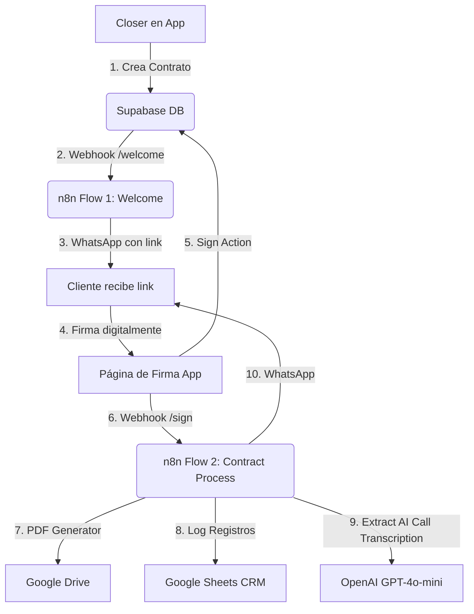

# Ecosistema de Contratos y Automatizaciones — Revolución Pineal

¡Bienvenido a la documentación técnica oficial del ecosistema **Revolución Pineal Closers App**. Este portal centraliza toda la información técnica, lógica y arquitectónica sobre la plataforma de gestión de contratos para Closers y sus flujos automatizados de integración de alumnos.

---

## 🌌 Visión General del Sistema

El ecosistema está diseñado para automatizar por completo la captación de información de ventas, la firma digitalizada de los acuerdos de acceso y la integración inmediata de alumnos en las plataformas del CRM ("CRM Escuela" en Google Sheets) y comunidades de comunicación de la escuela (WhatsApp).

El flujo operativo se describe en el siguiente diagrama:

---

## 📂 Directorio de Documentación

Navega a través de los diferentes módulos técnicos para comprender o realizar mantenimiento sobre el ecosistema:

### ⚙️ [1. Arquitectura del Proyecto](file:///d:/devWork/lucem/proyects/revolucion-pineal-closers-app/src/docs/arquitectura-proyecto.md)
*Detalle del núcleo del frontend y backend:*
* **Next.js 16** (App Router, Server Components y Server Actions).
* Autenticación híbrida y persistencia con **Supabase SSR** y control de middleware (`proxy.ts`).
* Flujos reactivos en tiempo real (`useContractsRealtime`).

### 🗄️ [2. Estructura de Datos y Contratos](file:///d:/devWork/lucem/proyects/revolucion-pineal-closers-app/src/docs/base-datos-contratos.md)
*Detalle del almacenamiento y las plantillas legales:*
* Esquema de tablas relacionales en **Supabase** (`contratos` y `user_profiles`).
* Mapeo de plantillas legales dinámicas (`contract-templates`).
* Firma digitalizada y trazabilidad legal en Base64.

### 🤖 [3. Automatizaciones y Flujos n8n](file:///d:/devWork/lucem/proyects/revolucion-pineal-closers-app/src/docs/flujos-n8n.md)
*Detalle de las integraciones con servicios de terceros:*
* Webhooks reactivos (`/welcome` y `/sign`).
* Conversión dinámica de HTML a PDF e interacción con la API de **Google Drive**.
* Registro y conciliación en hojas de cálculo con **Google Sheets**.
* **Agente AI con OpenAI** para la extracción analítica de Objetivos, Dolores y Deseos desde la transcripción de la llamada.
* Envío automatizado de mensajes de bienvenida y enlaces de onboarding por WhatsApp mediante **WasenderAPI** (lógica por closer y onboarding de Raffaele).

### 🚀 [4. Guía de Despliegue en Cloudflare](file:///d:/devWork/lucem/proyects/revolucion-pineal-closers-app/src/docs/despliegue-cloudflare.md)
*Detalle completo del empaquetamiento y publicación:*
* Configuración de **OpenNext** y el archivo `wrangler.jsonc`.
* Solución a incompatibilidades del Edge Runtime de Next.js 16 y el empaquetado de Webpack en Windows.
* Configuración segura de secretos y variables de entorno Supabase/n8n en la nube.

---

## 🛠️ Tecnologías Clave

* **Frontend**: Next.js 16 (React 19), Tailwind CSS, Lucide React, react-signature-canvas.
* **Backend & Realtime**: Supabase SSR (@supabase/ssr).
* **Orquestador**: n8n workflows (JSON configurados localmente en `n8n_workflows/`).
* **Inteligencia Artificial**: OpenAI GPT-4o-mini API.
* **Mensajería**: WasenderAPI (Endpoints de mensajería y grupos de WhatsApp).

---

## 🔑 Variables de Entorno

El ecosistema requiere la configuración de variables clave en un archivo `.env.local` basado en un `.env.example`. Asegurar la definición de:
* `NEXT_PUBLIC_SUPABASE_URL` y `NEXT_PUBLIC_SUPABASE_ANON_KEY`.
* Endpoints de webhooks de n8n.
* Claves de acceso para OpenAI y WasenderAPI.

## 🚀 Comandos y Scripts

* `npm run dev`: Inicia el servidor de desarrollo en `localhost:3000`.
* `npm run build`: Compila la aplicación para producción.
* `npx supabase gen types`: (Opcional) Sincroniza el tipado TypeScript de la base de datos localmente.
